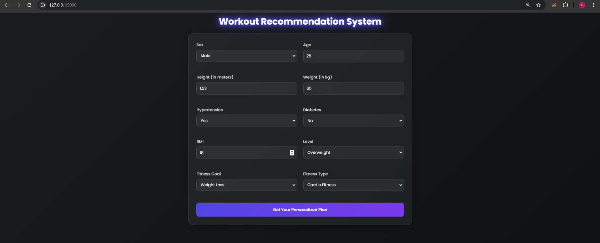
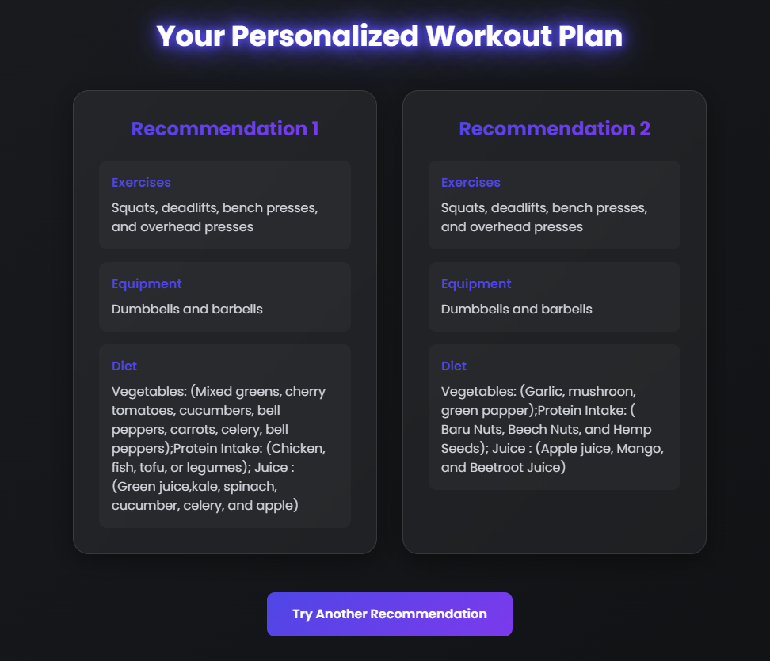

# Workout Recommendation System 
**A personalized fitness journey starts here.**

## 🖼️ Screenshots

### Home Page


### Recommendation Page


---

## 🚀 Project Overview
The **Workout Recommendation System** is a smart solution designed to help users find personalized workout routines based on their fitness level, goals, and preferences. This system leverages machine learning and user-friendly interfaces to make fitness recommendations accessible and effective for everyone.

---

## 🔧 Features

- **Personalized Recommendations**: Tailored workout plans based on user inputs such as age, weight, fitness level, and goals.
- **User-Friendly Interface**: Easy-to-use design for effortless navigation.
- **Dynamic Adjustments**: Continuously adapts recommendations based on user progress.
- **Comprehensive Workouts**: Supports multiple workout types, including cardio, strength training, yoga, and flexibility exercises.

---

## 🛠️ Tech Stack

- **Web App**: Flask, HTML, CSS
- **Database**: CSV user data
- **Libraries**:
  - Scikit-learn: Recommendation model
  - Pandas: Data processing
  - NumPy: Numerical computations
  - Docker: Containerization and deployment

---

## 🎯 How It Works

1. **User Input**: Users provide their basic information (e.g., age, weight, and fitness goals).
2. **Recommendation Engine**: Using a machine learning model, the system analyzes user data to suggest personalized workout plans.
3. **Output**: Recommended workouts are displayed with detailed instructions and visual aids.

---

## 🧰 Installation and Setup

### Prerequisites
- Python 3.8+
- Streamlit
- Docker (optional)

### Installation Steps

1. Clone the repository:
   ```bash
   git clone https://github.com/snehpatel38/workout_recommendation_system.git
   cd workout_recommendation_system
   ```
2. Install required dependencies:
   ```bash
   pip install -r requirements.txt
   ```
3. Run the application locally:
   ```bash
   streamlit run app/app.py
   ```
4. Access the application at `http://localhost:5000`.

### Using Docker

1. Build the Docker image:
   ```bash
   docker build -t workout-recommendation-system .
   ```
2. Run the Docker container:
   ```bash
   docker-compose up
   ```
3. Access the application at `http://localhost:5000`.

---

## 📂 Project Structure

```
workout_recommendation_system/
├── app/                 # Main Streamlit app file
├── requirements.txt     # Python dependencies
├── Dockerfile           # Docker image configuration
├── docker-compose.yml   # Docker Compose configuration
├── gym_recommendation.xlsx # Dataset for gym/workout recommendations
├── test_app.py          # Test scripts for the app
├── Workout_recommendation_final.ipynb # Jupyter notebook for experiments
└── README.md            # Project documentation
```

---

## 📊 Dataset
The system uses a dataset containing information about various workouts, fitness levels, and target goals. The dataset has been cleaned and preprocessed for optimal model performance. *([DataSetLink->](https://data.mendeley.com/datasets/zw8mtbm5b9/1))*

---

## More Details : https://snehpatel38.github.io/workout_recommendation_system/

### 🌟 Don't forget to ⭐ this repository if you find it useful!
